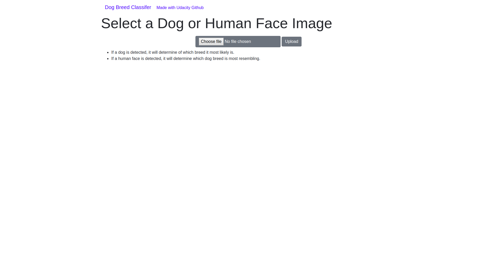
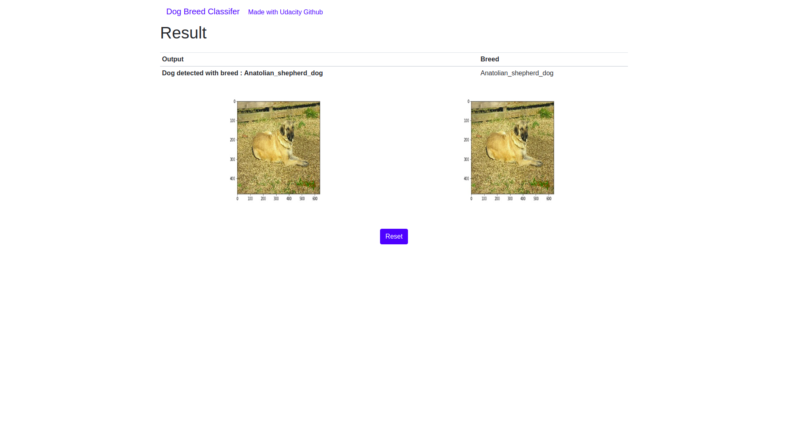
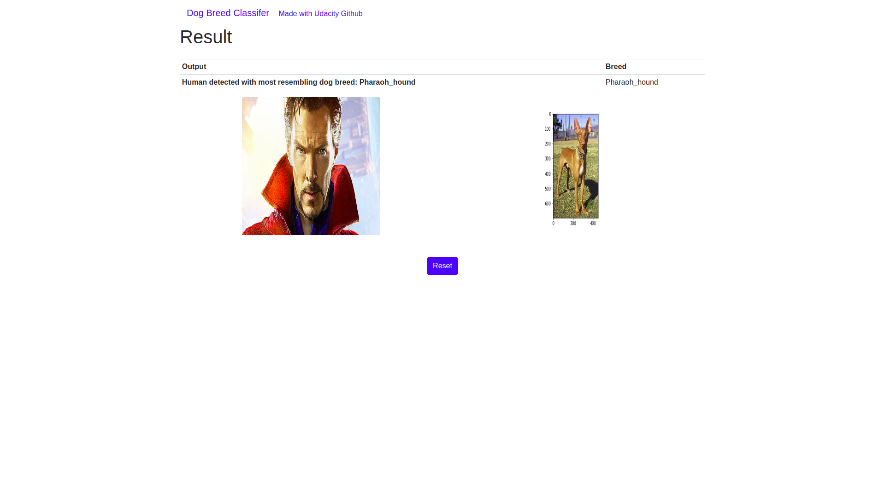
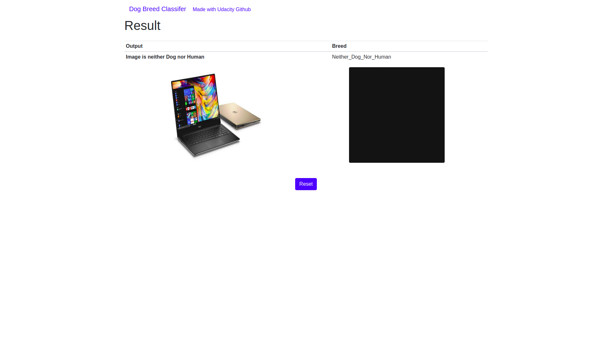

## Overview

Web app for dog breed prediction [Udacity's Dog Breed Classifier Project](https://github.com/udacity/dog-project.git).

The model used for classifying is trained on 133 different dog breeds and used the pre-trained Resnet50 model weights (thorugh Transfer Learning)

## Table of Contents
1. Installation
2. Project Motivation
3. File Descriptions
4. Summary of Model and Results
5. Licensing, Authors, and Acknowledgements

## Installation

1. Clone the repository.
    ```	
    git clone https://github.com/naveen1107/dogClassifier
    cd app
    ```

2. Create and activate a new virtual environment.
    ```
    python3 -m virtualenv venv
    source venv/bin/activate
    ```

3. Download the dependencies using pip.
    ```
    pip install -r Requirements.txt
    ```

4. Start the app locally

* either by

    ```
    python run.py
    ```

* or using the flask run command

    ```
    export FLASK_DEBUG=1
    export FLASK_ENV=development
    export FLASK_APP=run.py
    flask run
    ```
## Project Motivation

My motivation for this project was to develop an image classifier using transfer learning with convolutional neural networks that can:

1. Identify whether the image is of a dog or a human.
2. If app detects a human, it'll return the dog breed that best resembles the human.
3q. If app detects a dog, will return the predicted breed of that dog.

I was also interested in working with Flask framework to deploy the models for further use of the app by other users.

## File Descriptions
The repository includes all of the required files that are  necessary to code and deploy the web app. The index.html file can be found in `app/templates` folder. This file includes the basic HTML and Bootstrap code for designing the web page. The complimentary  CSS code can be found in the `app/static` folder. The saved Keras model (`weights.best.Resnet50.hdf5`), pre-trained face detector file (`haarcascades/haarcascade_frontalface_alt.xml`) can be found in the static folder. Lastly, a corresponding image of each dog breed can be found in the Sample_breed_img folder.

The `model.py` contains all of the necessary functions for getting the dog breed prediction from the uploaded file:

- `detector.py` contains the script for detecting whether the image is of a human or a dog.
- `preprocess.py` contains additional helper functions to preprocess the uploaded image.
- `model.py` is the main prediction script that utilizes the detector functions and helper functions

The requirements.txt file includes all of therequired libraries for this project.

**You can find the Data Preparation, Data Preprocessing and Model training Code in dog_app.ipynb file**

## Summary of Model and Results

I used transfer learning to create a convolutional neural network using bottleneck features from a Resnet50 model pre-trained on the ImageNet dataset. Bottleneck features are the last activation maps before the fully-connected layers, and using them allows us to make use of the weights already optimized by the pre-trained model. Transfer learning helps us to reduce amount of training time without loosing accuracy by training on the newly added layers.

The model architecture used is as follows:

- Input layer: The output of the ResNet50 model (the bottleneck features)
- Global Average Pooling layer
- Fully connected layer with a softmax activation function

The model was trained on 6680 dog images using 50 epochs to find the best weights. I then used the trained model to predict the results of 836 test dog images. The result was a test accuracy of 71%.

### Detector Results:

With a small test set of 100 human face images and 100 dog images, the following result was determined:

- Human face detector: A human face was accurately detected in 100% of the human images and 11% of the dog images.
- Dog detector: A dog was correctly detected in 0% of the human images and 100% of the dog images.

Potential points of improvement:

- An ensemble approach could be a better option in order to further improve prediction accuracy
- Training the model with images having some noise.
- Training the model with a larger variety of dog breeds.
- Training the model with images from different angles.
- Should add data augmentation as well.

App Result
* If a dog image is detected: 
    * It will classify the breed of dog belongs to 
* If a human face is detected: 
    * It will detect the given human face most resembling dog breed.
* if neither human nor dog is detected:
    * It will show the uploaded image and a blank result image

## Licensing, Authors, and Acknowledgements

I'd like to thank the Udacity Data Science Nanodegree team for the inspiration for this project and for template code for the CNN image classifier.

## App Screenshots








